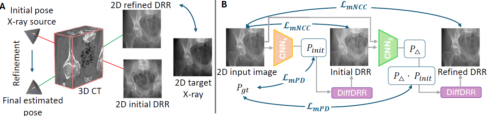

# LXPose: Multi-stage CNN for fast registration of 3D preoperative CTs to 2D intraoperative X-rays

Accepted [paper](https://arxiv.org/abs/xxxx.xxxxx) at **[MICCAI 2025 CoLaS Workshop](https://miccai.org/2025/workshops/colas)**

---

- [Overview](#overview)
- [Content](#content)
- [Usage](#usage)
- [How to run](#how-to-run)
- [Cite us](#cite-us)
- [Contact](#contact)
## Overview

Minimally invasive interventions often rely on live 2D X-rays
for image guidance. Yet, anatomical localization and procedural accuracy
can be enhanced by spatial alignment of these intraoperative X-rays with
3D preoperative computed tomographies (CTs). This 3D/2D registration
problem is typically formulated as pose estimation of the X-ray source
relatively to the CT, which is done by simulating synthetic X-rays from
2D projections of CT volumes. However, the optimization-based refine-
ment used by the state-of-the-art deep learning approach takes several
seconds, thus exceeding the allowed time budget in live image guidance.
In this paper, we propose LXPose (Live X-ray Pose estimation), a self-
supervised multi-stage 3D/2D registration framework for real-time image
guidance. LXpose removes the dependency on optimization and leverages
a two-stage CNN trained with a projection loss to ensure high accu-
racy and computational efficiency. Moreover, we apply extensive data
augmentation to mitigate the domain gap between simulated and real
X-rays. Overall, LXPose yields comparable 2D registration error to the
state-of-the-art method, while reducing inference time to 20ms, which
demonstrates the potential of LXPose for real-time clinical deployment.

  

